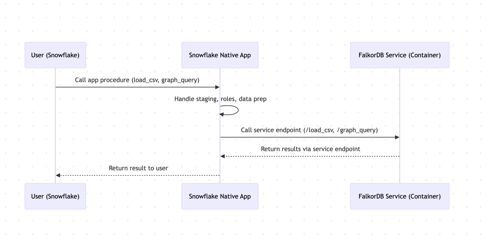

# FalkorDB Snowflake Native App

FalkorDB is a high-performance graph database that runs natively within your Snowflake environment, enabling you to transform relational data into graph structures and execute powerful Cypher queries without leaving Snowflake.

---

## Overview

FalkorDB Graph Database for Snowflake enables data teams to unlock the power of connected data through native graph analytics and AI-driven insights directly within their Snowflake environment. Transform your Snowflake tables into graph structures, execute Cypher queries, and leverage GraphRAG capabilities—all running securely within your Snowflake account.

---

## Prerequisites

Before installing this app, ensure you have:

- **Snowflake Account**: Active Snowflake account with ACCOUNTADMIN role privileges (required for granting application privileges)
- **Compute Resources**: Ability to create compute pools and warehouses in your account
- **Existing Data** (optional): Snowflake tables containing the data you wish to analyze as graphs, or use the built-in sample data

**No External Credentials Required**: This app runs entirely within your Snowflake environment. No external API keys, passwords, or third-party service credentials are needed. All data processing occurs within your Snowflake account boundaries.

---

## Key Features

- **Seamless Data Import**: Load data directly from Snowflake tables into graph structures using simple SQL procedures
- **Native Cypher Support**: Execute powerful Cypher queries on your graph data through familiar SQL interfaces
- **GraphRAG Integration**: Transform raw data into contextual knowledge for AI and LLM applications
- **Secure & Self-Contained**: All code and dependencies run within your Snowflake account—no remote code execution
- **Fully Transparent**: All application code is human-readable and auditable (no obfuscation)
- **Enterprise-Ready**: Built on Snowpark Container Services for scalable, production-grade performance

---

## Architecture



---

## Installation & Quick Start

### Step 1: Install the Application

1. Navigate to the Snowflake Marketplace and locate "FalkorDB Graph Database"
2. Click "Get" to install the application in your Snowflake account
3. Grant the requested privileges when prompted:
   - `BIND SERVICE ENDPOINT`: Allows the app to expose internal service endpoints
   - `CREATE COMPUTE POOL`: Allows the app to create compute pools automatically
   - `CREATE WAREHOUSE`: Allows the app to create warehouses automatically
4. Complete the installation process

### Step 2: Bind Your Data Table

After installation, bind a table from your account to the application:

1. Navigate to **Data Products** → **Apps** in Snowsight
2. Click on your installed FalkorDB app instance
3. Go to the **Permissions** tab
4. Under **Object access privileges**, find **Consumer Data Table**
5. Click **Select Data** and choose the table containing your graph data
6. Grant SELECT privilege when prompted

The table you bind will be used by the `load_csv` procedure to import data into graph structures.

### Step 3: Initialize the Application

The app will automatically create the required compute pool and warehouse when you start it:

```sql
-- Initialize FalkorDB - it will create compute pool and warehouse automatically
CALL <app_instance_name>.app_public.start_app('FALKORDB_POOL', 'FALKORDB_WH');
```

**Default Resource Configuration**:
- **Compute Pool**: `CPU_X64_S` instance family (4 CPU, 8GB RAM), 1 node, auto-resume enabled
- **Warehouse**: `XSMALL` size, initially suspended, auto-suspend after 300 seconds

**Advanced**: If you need custom resource sizes, create them manually **before** calling `start_app()`:

```sql
-- Optional: Create custom compute pool (if you need different specs)
CREATE COMPUTE POOL FALKORDB_POOL
    MIN_NODES = 1
    MAX_NODES = 3
    INSTANCE_FAMILY = CPU_X64_M  -- Larger instance
    AUTO_RESUME = TRUE;

-- Optional: Create custom warehouse (if you need different size)
CREATE WAREHOUSE FALKORDB_WH WITH
    WAREHOUSE_SIZE = 'MEDIUM'    -- Larger warehouse
    AUTO_SUSPEND = 600
    AUTO_RESUME = TRUE;

-- Then initialize (will use your existing resources)
CALL <app_instance_name>.app_public.start_app('FALKORDB_POOL', 'FALKORDB_WH');
```

**Important**: Replace `<app_instance_name>` with the name you chose during installation.

### Step 4: Verify Table Binding (Optional)

You can verify the table binding at any time:

```sql
CALL <app_instance_name>.app_public.check_bound_table();
```

To change the bound table, return to the **Permissions** tab in the app UI.

### Step 5: Load Your Data

Import data from your bound table into a graph structure:

```sql
-- Example: Create a social network graph from your bound table
CALL <app_instance_name>.app_public.load_csv(
    'social_network',
    'LOAD CSV FROM ''file://consumer_data.csv'' AS row MERGE (p:Person {id: row[0]}) ON CREATE SET p.name = row[1] ON MATCH SET p.name = row[1]'
);
```

**Note**:
- The table is automatically retrieved from your Config UI binding—no need to specify it as a parameter
- The Cypher query must include `LOAD CSV FROM 'file://...' AS row` to access the CSV data via `row[0]`, `row[1]`, etc.

### Step 6: Query Your Graph

Execute Cypher queries to analyze relationships and patterns:

```sql
-- Find all persons in the graph
CALL <app_instance_name>.app_public.graph_query(
    'social_network',
    'MATCH (n:Person) RETURN n.name, n.id LIMIT 10'
);

-- Find connections between people
CALL <app_instance_name>.app_public.graph_query(
    'social_network',
    'MATCH (p1:Person)-[r:KNOWS]->(p2:Person) 
     RETURN p1.name, p2.name'
);
```

---

## Quick Start with Sample Data

Want to try FalkorDB without setting up your own data? Use the built-in sample data loader:

```sql
-- 1. Make sure the service is running
CALL <app_instance_name>.app_public.get_service_status();

-- 2. Load sample social network (5 people with relationships)
CALL <app_instance_name>.app_public.load_sample_social_network();

-- 3. Query the sample data
CALL <app_instance_name>.app_public.graph_query(
    'demo_social_network',
    'MATCH (p:Person) RETURN p.name, p.age, p.city'
);

-- 4. Find relationships in the sample network
CALL <app_instance_name>.app_public.graph_query(
    'demo_social_network',
    'MATCH (a:Person)-[r:KNOWS]->(b:Person) 
     RETURN a.name, b.name, r.since'
);
```

---

## Available Procedures

The FalkorDB app provides the following SQL procedures for graph management and querying:

### Graph Management

**`start_app(poolname VARCHAR, whname VARCHAR)`**
- Initializes the FalkorDB service with specified compute pool and warehouse names
- Automatically creates the compute pool (CPU_X64_S) and warehouse (XSMALL) if they don't exist
- If resources already exist, uses them instead of creating new ones
- Example: `CALL app_public.start_app('FALKORDB_POOL', 'FALKORDB_WH');`

**`load_csv(graph_name VARCHAR, cypher_query VARCHAR)`**
- Imports data from your bound table (configured during installation) into a graph structure
- Uses the table reference you selected in the Config UI
- Automatically stages data, loads it into FalkorDB, and cleans up temporary files
- Example: `CALL app_public.load_csv('my_graph', 'LOAD CSV FROM ''file://consumer_data.csv'' AS row MERGE (n:Node {prop: row[0]})');`
- **Note**: The Cypher query must include `LOAD CSV FROM 'file://...' AS row` clause to access CSV columns via `row[0]`, `row[1]`, etc.

**`graph_list()`**
- Returns a list of all graphs created in your FalkorDB instance
- Example: `CALL app_public.graph_list();`

**`graph_delete(graph_name VARCHAR)`**
- Permanently deletes a specified graph and all its data
- Example: `CALL app_public.graph_delete('my_graph');`

**`load_sample_social_network()`**
- Creates a demo social network graph with sample data for testing
- Creates 5 person nodes (Alice, Bob, Carol, David, Eve) with relationships
- Graph name: `demo_social_network`
- Example: `CALL app_public.load_sample_social_network();`

### Graph Querying

**`graph_query(graph_name VARCHAR, cypher_query VARCHAR)`**
- Executes Cypher queries against a specified graph
- Returns query results in Snowflake-compatible format
- Example: `CALL app_public.graph_query('my_graph', 'MATCH (n) RETURN n LIMIT 10');`

### Administrative Functions

**`check_bound_table()`**
- Verifies that a table reference is properly bound to the application
- Returns success message if bound, error message if not
- Example: `CALL app_public.check_bound_table();`

**`get_service_status()`**
- Returns the current status of the FalkorDB service

**`get_service_logs(container_name VARCHAR, num_lines INTEGER)`**
- Retrieves service logs for troubleshooting

**`get_service_containers()`**
- Lists all running FalkorDB service containers

---

## How It Works

FalkorDB operates entirely within your Snowflake environment using Snowpark Container Services:

1. **Installation**: When you install the app, it registers the necessary privileges and creates application roles within your Snowflake account

2. **Resource Creation**: You create a compute pool and warehouse in your account and grant the necessary permissions to the application

3. **Initialization**: When you call `start_app()`, the app:
   - Creates a service using your provided compute pool and warehouse
   - Launches the FalkorDB graph database container
   - Creates wrapper procedures for graph operations

3. **Data Loading**: When you call `load_csv()`, the app:
   - Exports your specified Snowflake table to a CSV file in a staging area
   - Mounts the CSV file to the FalkorDB container
   - Executes your Cypher query to map CSV data into graph structures
   - Automatically cleans up temporary files

4. **Querying**: When you call `graph_query()`, the app:
   - Routes your Cypher query to the FalkorDB service endpoint
   - Executes the query against the specified graph
   - Returns results in Snowflake-compatible format

All processing occurs within your Snowflake account boundaries—no data leaves your environment.

---

## Security Compliance

This app **fully conforms** to Snowflake's [security requirements for application code](https://docs.snowflake.com/en/developer-guide/native-apps/security-app-requirements#security-requirements-for-application-code):

- **No Remote Code Execution**: All code is packaged within the app—no external code is loaded or executed
- **Full Transparency**: All code (including JavaScript) is human-readable with no obfuscation
- **Dependency Security**: All dependencies are included and free of critical/high CVEs
- **No Hardcoded Secrets**: No API keys, passwords, or credentials are stored in plain text
- **Isolated Execution**: All operations run within your Snowflake account boundaries

---

## Support & Resources

### Documentation
- **FalkorDB Documentation**: [https://docs.falkordb.com](https://docs.falkordb.com)
- **Cypher Query Language**: [https://docs.falkordb.com/cypher](https://docs.falkordb.com/cypher)
- **Snowflake Native Apps**: [https://docs.snowflake.com/en/developer-guide/native-apps](https://docs.snowflake.com/en/developer-guide/native-apps)

### Community & Support
- **GitHub Repository**: [https://github.com/FalkorDB/snowflake-integration](https://github.com/FalkorDB/snowflake-integration)
- **Report Issues**: Open an issue on our GitHub repository
- **Community Forum**: Join the FalkorDB community discussions

### Contact
For enterprise support inquiries, please visit [https://falkordb.com](https://falkordb.com)

---

## License

This Snowflake Native App is provided by FalkorDB. Please refer to the [LICENSE](https://github.com/FalkorDB/snowflake-integration/blob/main/LICENSE) file for terms and conditions.
